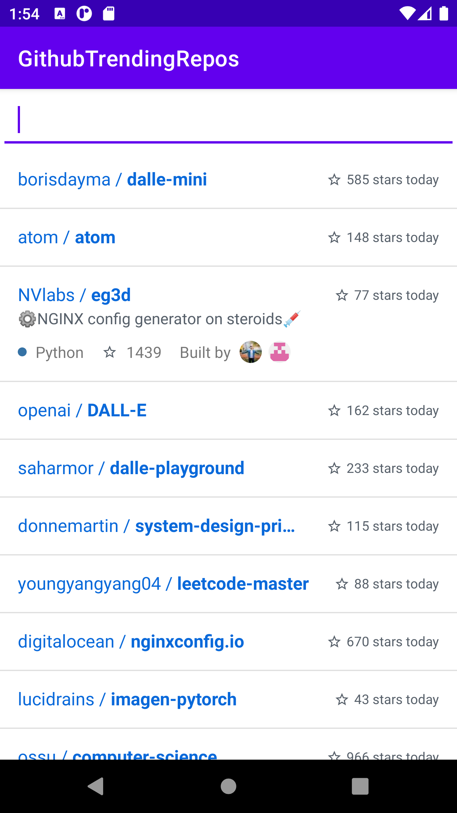
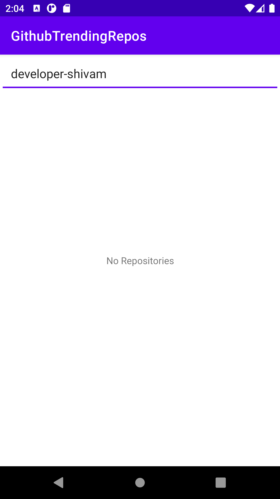

# GithubTrendingRepos

Showing list of trending repositories using following source - https://gh-trending-api.herokuapp.com
I guess there is no Github API to fetch trending repositories

- MVVM Architecture
- 100% Kotlin project
- Unit Testing with 100% code coverage of both ViewModel and DataManager
- Using Dagger 2 for dependency Injection
- Used standard libaries like Retrofit, Glide

    
    
    

